# Architecture Diagrams

## Local PKI Architecture

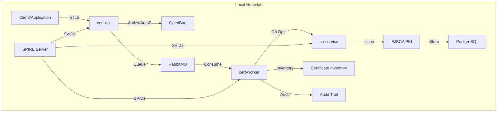

## Cloud-Neutral Architecture

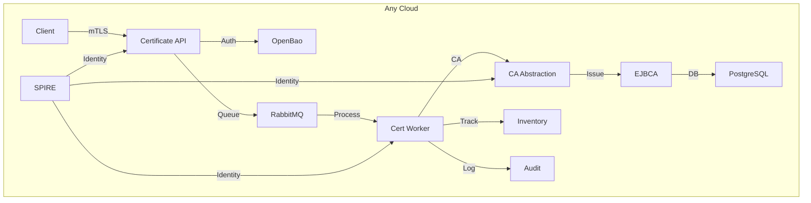

## Azure Architecture

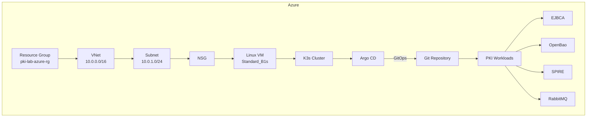

## AWS Architecture

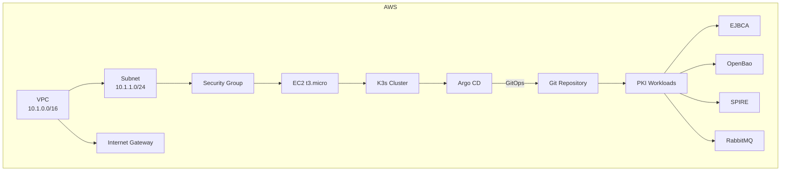

## Terraform Workflow

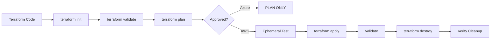

## K3s Bootstrap

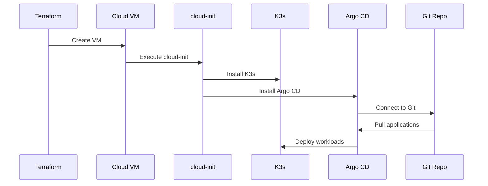

## Argo CD GitOps Flow

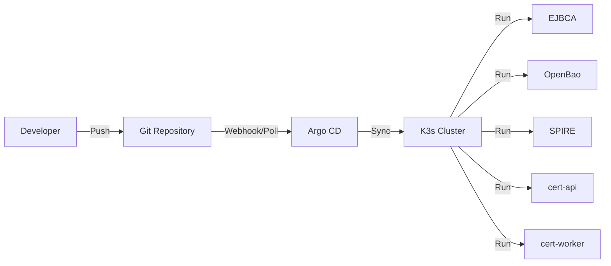

## SPIFFE Identity Flow

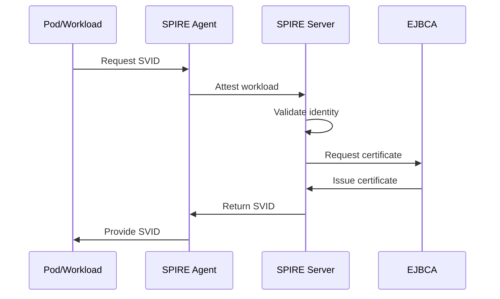

## Certificate Issuance

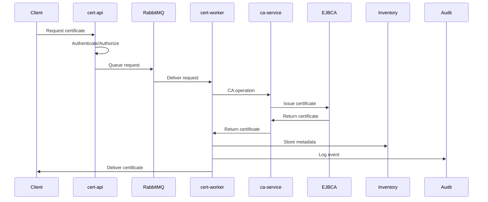

## Certificate Renewal

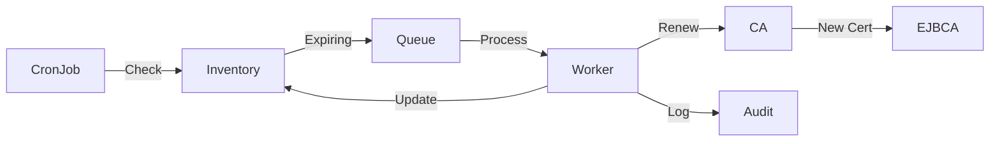

## Certificate Revocation

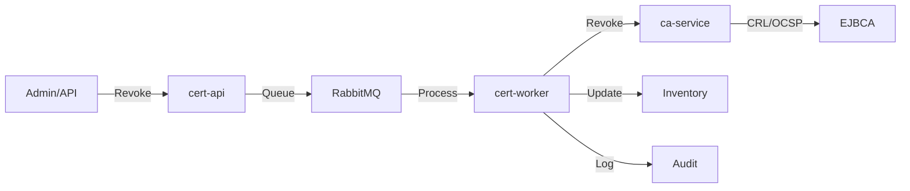

## Cloud Teardown

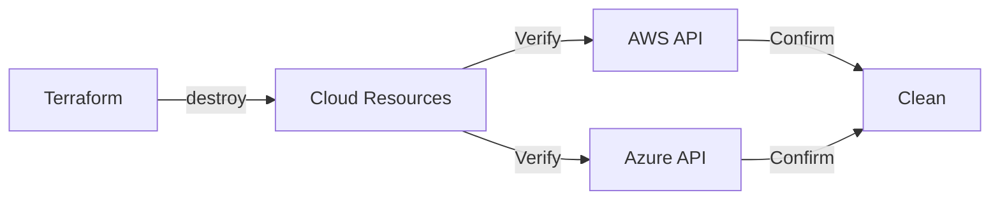
